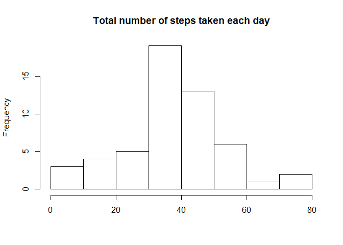
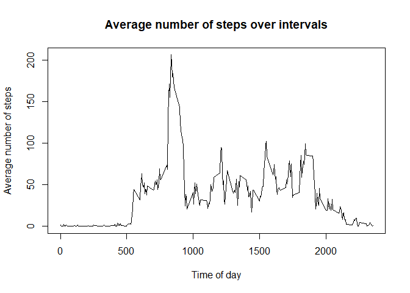
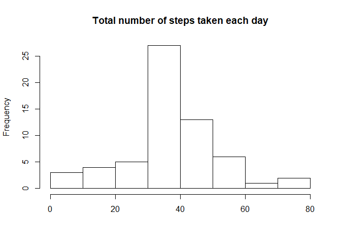
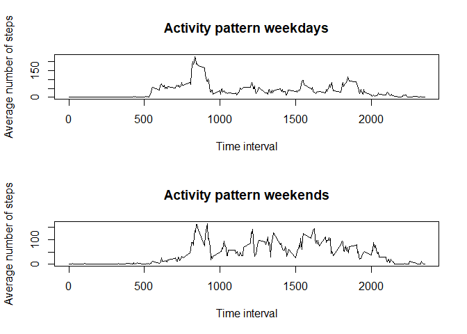

It is now possible to collect a large amount of data about personal movement using activity monitoring devices such as a Fitbit, Nike Fuelband, or Jawbone Up. These type of devices are part of the "quantified self" movement -- a group of enthusiasts who take measurements about themselves regularly to improve their health, to find patterns in their behavior, or because they are tech geeks. But these data remain under-utilized both because the raw data are hard to obtain and there is a lack of statistical methods and software for processing and interpreting the data.

This assignment makes use of data from a personal activity monitoring device. This device collects data at 5 minute intervals through out the day. The data consists of two months of data from an anonymous individual collected during the months of October and November, 2012 and include the number of steps taken in 5 minute intervals each day.

Load these packages

```r
library(dplyr)
```

```
## 
## Attaching package: 'dplyr'
```

```
## The following objects are masked from 'package:stats':
## 
##     filter, lag
```

```
## The following objects are masked from 'package:base':
## 
##     intersect, setdiff, setequal, union
```

```r
library(plyr)
```

```
## -------------------------------------------------------------------------
```

```
## You have loaded plyr after dplyr - this is likely to cause problems.
## If you need functions from both plyr and dplyr, please load plyr first, then dplyr:
## library(plyr); library(dplyr)
```

```
## -------------------------------------------------------------------------
```

```
## 
## Attaching package: 'plyr'
```

```
## The following objects are masked from 'package:dplyr':
## 
##     arrange, count, desc, failwith, id, mutate, rename, summarise,
##     summarize
```


## Loading and preprocessing the data

Use the following code to load the data.


```r
temp <- tempfile()
download.file("https://d396qusza40orc.cloudfront.net/repdata%2Fdata%2Factivity.zip",temp)
dat <- read.csv(unz(temp, "activity.csv"), header = TRUE, na.strings = "NA")
unlink(temp)
```

The following transformations are necessary:
Group the data


```r
dat$date<-as.Date(dat$date, "%Y-%m-%d")
ave_steps_per_day<-aggregate(steps ~ date, dat, mean)
```

The variables included in this dataset are:
*steps: Number of steps taking in a 5-minute interval (missing values are coded as NA)
*date: The date on which the measurement was taken in YYYY-MM-DD format
*interval: Identifier for the 5-minute interval in which measurement was taken
The dataset is stored in a comma-separated-value (CSV) file and there are a total of 17,568 observations in this dataset.

## What is mean total number of steps taken per day?

Make a histogram of the total number of steps taken each day.


```r
hist(ave_steps_per_day$steps, main = "Total number of steps taken each day", xlab = "")
```

<!-- -->

Calculate and report the mean and median total number of steps taken per day


```r
mean_daily<-mean(ave_steps_per_day$steps)
median_daily<-median(ave_steps_per_day$steps)
```

The mean number of steps per day is 37.3825996.
The median number of steps per day is 37.3784722.

## What is the average daily activity pattern?

Here is a line plot of the average daily activity over the time intervals.


```r
ave_daily_activity<-aggregate(steps ~ interval, dat, mean.default)
plot(ave_daily_activity$interval, ave_daily_activity$steps, type = "l", main = "Average number of steps over intervals", xlab = "Time of day", ylab = "Average number of steps")
```

<!-- -->


```r
max_steps<-max(ave_daily_activity$steps)
max_steps_time<-filter(ave_daily_activity, steps == max_steps)
```

The 5-minute interval, on average across all the days in the dataset, that contains the maximum number of steps is 835.

## Imputing missing values


```r
nas<-sum(is.na(dat))
```

This data set contains 2304 number of NAs.

I replace each of the NAs with the average of the interval to create a new dateset.


```r
impute <- function(x, fun) {
    missing <- is.na(x)
    replace(x, missing, fun(x[!missing]))
}

    
dat2<-ddply(dat, ~ interval, transform, steps = impute(steps, mean))
```
Here is what the average daily steps look like now:


```r
ave_steps_per_day_no_na<-aggregate(steps ~ date, dat2, mean)
hist(ave_steps_per_day_no_na$steps, main = "Total number of steps taken each day", xlab = "")
```

<!-- -->

```r
mean_daily_no_nas<-mean(ave_steps_per_day_no_na$steps)
median_daily_no_nas<-median(ave_steps_per_day_no_na$steps)
```

Comparing the histograms from when the NAs were obmitted and when they were imputed with the interval average, the new data set has more days with between 30 and 40 steps per day.  While the mean is the is same (37.3825996 omitting NAs and 37.3825996 with imputed NAs) the median is slightly higher (37.3784722 ommitting NAs and 37.3825996 with imputed NAs).

## Are there differences in activity patterns between weekdays and weekends?


```r
dat3<-mutate(dat2, day = weekdays(dat2$date))
dat3$day <- ifelse(weekdays(dat3$date) %in% c("Saturday", "Sunday"), "weekend", "weekday")
dat3_weekday<-filter(dat3, day== "weekday")
dat3_weekend<-filter(dat3, day=="weekend")

ave_daily_activity_no_nas_weekday<-aggregate(steps ~ interval, dat3_weekday, mean.default)
ave_daily_activity_no_nas_weekend<-aggregate(steps ~ interval, dat3_weekend, mean.default)

par(mfrow=c(2,1))
plot(ave_daily_activity_no_nas_weekday$interval, ave_daily_activity_no_nas_weekday$steps, type = "l", main = "Activity pattern weekdays", xlab = "Time interval", ylab = "Average number of steps")
plot(ave_daily_activity_no_nas_weekend$interval, ave_daily_activity_no_nas_weekend$steps, type = "l",  main = "Activity pattern weekends", xlab = "Time interval", ylab = "Average number of steps")
```

<!-- -->

Based on the graphs, you can see that activity starts later on the weekends but has a similar peak aroudn 8am.  There is more activity during the day on the weekends, and activity stretches later into the evening, passed 8pm.
